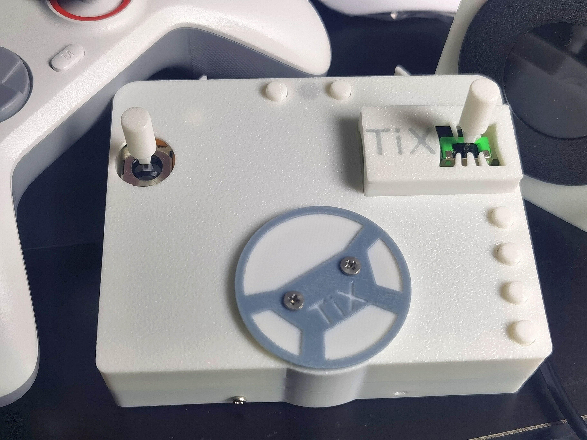
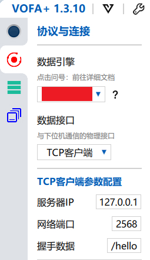
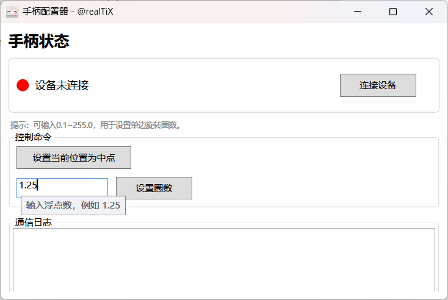

# 力反馈方向盘手柄，带有排挡

- [力反馈方向盘手柄，带有排挡](#力反馈方向盘手柄带有排挡)
  - [一、项目简介](#一项目简介)
  - [二、开源管理](#二开源管理)
  - [三、烧录](#三烧录)
  - [四、调试](#四调试)
  - [五、使用方法](#五使用方法)
  - [六、赞助](#六赞助)

## 一、项目简介

这是一个带有力反馈方向盘和小型排挡的游戏手柄，目前在欧卡2与神力科莎上测试通过。  
力反馈部分通过 无刷电机 FOC 实现，排挡部分为原创的微小且简易的结构。  
支持自定义方向盘的限位与中点，开机时可以直接配置，或者开机后也可通过串口或 usb 上位机进行修改，usb 上位机目前仅提供给付费用户。

本项目使用了自研的裸机调度器 LTX V3，提供更高效的响应与更好的开发体验：

* Github：[TiX233/ltx](https://github.com/TiX233/ltx)
* Gitee：[TiX233/ltx](https://gitee.com/TiX233/ltx)

本项目有一篇三万字的配套博客，主要讲解 FOC 相关内容，可以使用您喜欢的平台阅读：
* CSDN：[FOC 迷你方向盘手柄配套博客](https://blog.csdn.net/realTiX/article/details/159834203)
* 知乎：[FOC 迷你方向盘手柄配套博客](https://zhuanlan.zhihu.com/p/2023857840624871392)
* 立创：[FOC 迷你方向盘手柄配套博客](https://oshwhub.com/realtix/works/article)

## 二、开源管理

> 仅供个人复刻学习用。  
未经授权，禁止商用，包括但不限于售卖成品、半成品、（以本项目名义的）套件包或（以本项目名义的）收费代制作等等。  
修改本项目以任何形式再发布都必须开源，不得删去原作者署名与开源协议。

本仓库负责管理本项目的单片机源码部分，所有部分开源链接如下：

* 单片机源码：
  * Github：[TiX233/force-feedback-steering-wheel-game-controller](https://github.com/TiX233/force-feedback-steering-wheel-game-controller)
  * Gitee：[TiX233/force-feedback-steering-wheel-game-controller](https://gitee.com/TiX233/force-feedback-steering-wheel-game-controller)
* 原理图/PCB：
  * 立创开源平台：[FOC力反馈方向盘手柄，带挡杆](https://oshwhub.com/realtix/project_pyptyrni)
* 外壳：
  * 立创开源平台附件

## 三、烧录

使用 `daplink/jlink/...` 等等 swd 调试器进行固件烧录，可使用 keil 编译源码烧录。因立创平台修改内容后会有约一天的审核时间，期间无法看到项目，所以不直接发布固件在立创附件。如果您不想配置开发环境自行编译源码烧录，那么在材料包售后群内会及时更新编译好的固件，以便您可以直接使用您的调试器商家提供的 swd 下载软件下载固件。

## 四、调试

如果您需要对本项目进行二次开发或拓展，那么应该需要一些调试手段。

本项目最初使用 RTT 进行调试信息输入输出，现改为串口，串口速度为 4M。如果需要，那么可以在宏定义切换回 RTT，以下是 RTT 相关的用法：  
`segger RTT` 会将输入输出信息保存在一块 ram 中，当调试器链接后，电脑用通过 `openOCD` 来对内存进行写入读出以实现输入输出，无需外设收发，并且还能保存一定的历史输出。  

如果您有 `jlink`，那么可以直接用 `segger` 提供的 `rttviewer` 进行调试，这里仅提供使用 `dap-link` 的调试方法：

1. 在普冉官网下载官方提供的 `openocd` 版本，将其加入环境变量
2. 链接调试器和设备，打开任意 `shell`，输入 `openocd -f rtt2tcp.cfg`
   * 注：如果没有加入环境变量，那么上述命令需要输入 openocd.exe 的完整路径
3. 打开任意支持 `tcp` 的串口调试工具，这里以 `vofa+` 为例，填入如下图的配置信息
   * 
4. 链接成功后，即可查看输入输出信息

通过自定义命令，可控制单片机的运行状态，比如使用 `/ltx_app` 命令暂停某些 app 等等，也可依赖发布订阅机制实现数据更新后的自动打印，在 `ltx_cmd.c` 中提供的 `/print` 命令有一个 `heart_beat` 样例，用来每秒打印心跳，您可参考该样例来设置自己的订阅数据打印；  
如果您需要经常修改一些变量如尝试某些不同的 pid 参数，那么也无需重新烧录，在 `ltx_cmd.c` 中提供了一个 `/param` 命令，该命令可对 `ltx_param.c` 中指向的自定义数据进行读写；

所有的自定义命令可在 `ltx_cmd.c` 中查看，也可开机后给单片机发送 `/help` 命令来列出所有命令，您也可以参考这些命令创建一些方便调试自定义命令，部分现有命令可能会影响系统的正常运行

## 五、使用方法

第一次开机后，按下彩灯右侧的按键则会进入方向盘较准，期间不要用手触碰方向盘，校准完毕后彩灯会变成紫色，电机会哔两声，此时将方向盘旋转至您所需要的中点，并且挂入某一挡位用于设置方向盘限位，每个挡位代表单边 0.25圈，例如挂入 5 挡就是 5\*0.25=1.25 圈，代表左右各 1.25 圈，加起来就是两圈半，再次按下灯右侧按键即可完成配置。如果后续想要修改，可以使用串口或者 usb 上位机修改。

后续每次开机会以开机时的位置作为方向盘中点，从闪存中读取电机校准值和圈数，上位机设置圈数和中点都是临时的，减少 flash 擦写寿命消耗，需要重新固化圈数请使用上位机擦除配置后重启设备，重复前述操作即可。

## 六、赞助

本项目的软硬件都是完全开源的，如果您乐见本项目长足发展，可以在作者咸鱼(id: realTiX)购买材料包或者通过以下方式直接对作者进行赞助：

在 [赞助名单与留言/赞助名单与留言.txt](./赞助名单与留言/赞助名单与留言.txt) 中将会不定期更新赞助名单
